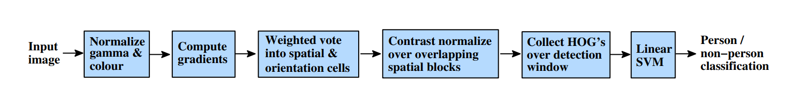
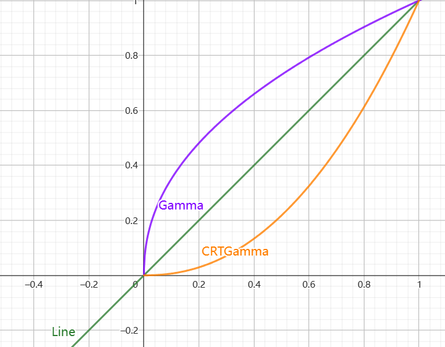
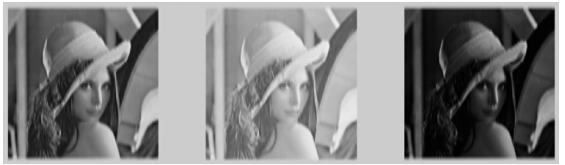
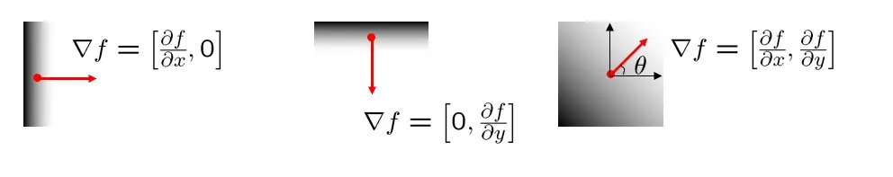
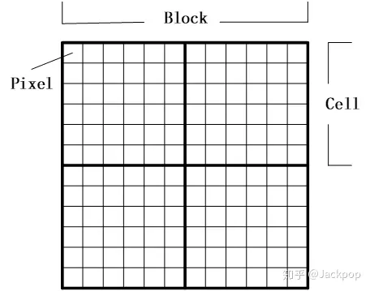
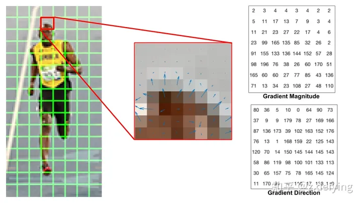
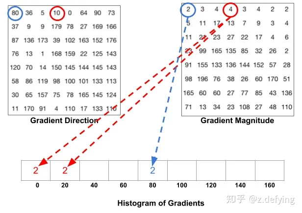
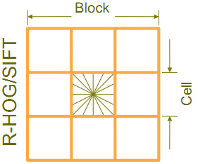
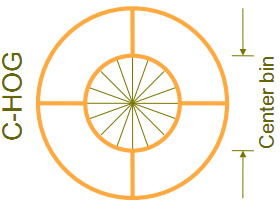
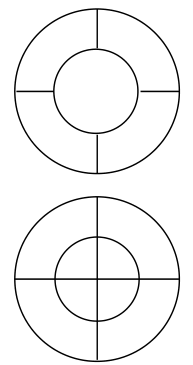

# Explain HoG

## 原文出处：

N. Dalal, and B. Triggs, Histograms of oriented gradients for human detection, Computer Vision and Pattern Recognition, CVPR 2005,Google Citations: 21911

## 简介

**Histograms of oriented gradients(HoG)**: 方向梯度直方图,一种特征提取算子

>特征提取算子：用来提取图像有效信息的计算方法

在 **HoG** 中，图像的梯度( $x, y$ 的导数/差分 )是有效的特征信息，因为 **edge** (一个方向上)和 **corner** (各个方向上)的梯度变化较大

## 过程

### Normailze gamma & colour

为了减少光照因素影响，用 Gamma矫正

>Gamma矫正简要：  
在显示器上的存储的图片的灰度接近于 $f(I) = Gamma(I)$，使用$f(I) = CRTGamma(I)$可以把其转换为原始线性灰度
使用 $f(I) = I^{\gamma}$ 可以改变图像的灰度

使用 $f(I) = I^{\gamma}$ 可以改变图像的灰度

可以看到:

$\gamma \leq 1$ 

>在低灰度值区域内，动态范围变大，图像对比度增加强
在高灰度值区域，动态范围变小，图像对比度降低
同时，图像的整体灰度值变大

$\gamma \geq 1$ 

>在低灰度值区域内，动态范围变小，图像对比度降低
在高灰度值区域，动态范围变大，图像对比度提高
同时，图像的整体灰度值变小

左图为原图,中间为$f(I) = I^{\frac{1}{2.2}}$,右图为$f(I) = I^{2.2}$

### Compute gradients
计算图像梯度向量
$\nabla f(x,y) = \left [ \begin{matrix}
                            \frac{\partial f}{\partial x} \\
                            \\
                            \frac{\partial f}{\partial y} \\
                        \end{matrix} \right ] 
                        =\left [ \begin{matrix}
                            f(x,y) - f(x - 1,y) \\
                            \\
                            f(x,y) - f(x,y - 1) \\
                        \end{matrix} \right ] $

梯度向量（梯度是有方向的）指向图像强度增长最快的方向

$\theta(x,y) = \arctan \frac{\frac{\partial f}{\partial y}}{\frac{\partial f}{\partial x}} = \arctan \frac{f(x,y) - f(x - 1,y)}{f(x,y) - f(x,y - 1)}$

梯度的模长（幅值）—— 数学意义是此处梯度变化的大小，为图像边缘的强度或可能性：

$|\nabla f(x,y)| = \sqrt{\frac{\partial f}{\partial x}^2 + \frac{\partial f}{\partial y}^2}$

### Weighted vote into spatial & orientation cells

**Weighted vote into spatial**: 空间加权投票(计算空间梯度直方图)

**orientation cells**：定向细胞(把图片分成小单元)

#### cell的梯度计算:
每个图像会被划分为 小单元 **cell** 

每个 **cell** 有两个的特征量: $|\nabla f(x,y)|$ 和 $\theta (x,y)$

每个像素按照他的梯度向量方向将自己的$|\nabla f(x,y)|$加权投票至对应通道

论文原文中说增加通道数量可以显著提升性能，最高可达九个通道(As fig. 4(b) shows, increasing the number of orientation bins improves performance significantly up to about 9 bins, but makes little difference beyond this)(对应 $[0,180]$ 无符号度数分类，但是我在查的时候，好像也有八个通道对应 $[0-360]$ 的有符号度数分类，最原文发现无向，九通道在行人识别中更加优势)

### Contrast normalize over overlapping spatial blocks

图像的梯度对整体光照非常敏感，比如通过将所有像素值除以2来使图像变暗，那么梯度幅值将减小一半，因此直方图中的值也将减小一半。 理想情况下，我们希望我们的特征描述符不会受到光照变化的影响，那么我们就需要将直方图“归一化” 。

几个 **cell** 构成了一个区块 **block**,这一步是对 **block** 的各个九维向量总的进行归一化

原文给了两种区间表示：

#### C-HoG 和 R-HoG

##### R-HoG 
按照图一的样式它可以有三个参数来表征：
每个区间中细胞单元的数目、每个细胞单元中像素点的数目、每个细胞的直方图通道数目
行人检测的最佳参数设置是：$3 \times 3$ 细胞 / 区间、$6 \times 6$ 像素/细胞、$9$个直方图通道

##### C-HOG
按照图二的样式，区间有两种不同的形式，它们的区别在于：一个的中心细胞是完整的，一个的中心细胞是被分割的。

每个区间可以用四个参数来表征：

**the numbers of angular and radial bins**

**the radius of the central**

**bin in pixels**

**the expansion factor for subsequent radii**

在实验中发现

**At least two radial bins (a centre and a surround) and four angular bins (quartering) are needed for good performance**

**4 pixels is the best radius for the central bin**

**increasing the number of angular bins decreases performance**

归一化的方法是把几个 **cell** 的直方图向量给拼在一起成为一个向量，然后对这个多维向量进行归一化

原文使用了四种对向量的归一化方法：

**L2-norm**  $\ v \to v / \sqrt{\|v\|_2^2 + \epsilon ^ 2}$ 

**L1-sqrt**  $\ v \to \sqrt{v / {(\|v\|_1 + \epsilon)}}$ 

**L1-norm**  $\ v \to {v / {(\|v\|_1 + \epsilon)}}$ 

**L2-Hys** 先用 **L2-norm** 然后进行切割(将值限定在 $[0.2v,v]$ 中)，然后再进行归一化

作者发现 **L2-norm**,**L1-sqrt**,**L2-Hys** 的效果相近，**L1-norm** 相对的不那么可靠，但归一化操作相比未归一化前有了巨大提升。

### Collect HoG's over detection window

将每个区间的归一化的向量拼接在一起，最后得到了图片的 **HoG** 特征向量

end.

# Explain SIFT

## 简介

尺度不变特征转换(**SIFT, Scale Invariant Feature Transform**)是图像处理领域中的一种**局部特征描述**算法. 该方法于1999年由加拿大教授David G.Lowe提出。

它在空间尺度中寻找极值点，并提取出其位置、尺度、旋转不变量的特征

## 高斯模糊

**SIFT** 通过在不同尺度上的检测来查找关键点，不同尺度空间的获取需要高斯模糊实现

我们有一个矩阵：

$\begin{bmatrix}1&1&1\\1&\textcolor{red}{2}&1\\1&1&1\end{bmatrix}$ 

我们为了让中间元素变得平滑，我们一个简单的想法是取周围八个元素的平均值

$\begin{bmatrix}1&1&1\\1&\textcolor{red}{1}&1\\1&1&1\end{bmatrix}$

那如果我们有一行向量呢

$(x_1,x_2,x_3,\textcolor{red}{x_4},x_5,x_6,x_7)$

为了让 $x_4$ 看上去平衡，我们应该怎么办呢

显然不应该直接取 $\frac{\sum x}{n}$,不同位置对 $x_4$ 的影响等价的话看起来不太合理,按理说应该较近的权值较高，较远的权值较低

正态分布的权值分配显然是一个可取的函数，我们可以取高斯函数 $G(r) = \frac{1}{\sqrt{2\pi\sigma^2}}e^{\frac{-d^2}{2\sigma^2}}$

其中 $d$ 为到中心的距离

显然当 $\sigma$ 越大的时候，所有位置的权值更接近，所以最终的高斯的模糊的效果更加平滑

这是一维序列上的高斯模糊的处理

如果我们在图像矩阵甚至更高维的向量上进行高斯模糊处理，我们需要更高维的高斯函数

下给定 $N$ 维空间下高斯权值对应的高斯函数

$G(r) = \frac{1}{(\sqrt{2\pi\sigma^2}) ^ N}e^{\frac{-r^2}{2\sigma^2}}$

其中 $r = |\vec{x} - \vec{m}|$,$\vec{m}$ 为中心点向量

理论上空间上任一高斯函数不为$0$，但依 $3\sigma$ 原则，在 $3\sigma$ 外的权值近乎不计

图像上应用的高斯卷积核一般取 $(2k + 1) \times (2k+1)$ 的矩阵大小

高斯核变大时直接使用矩阵卷积的计算开销较大，我们发现 $r^2 = \sum (x _i - m_i) ^ 2$

我们可以在维度上拆解计算，将 $n \times n$ 的卷积核拆建成多维 $1\times n$ 卷积

从 $ O(W\times H\times n\times n) $ 复杂度变为 $O(d\times W\times H\times n)$

## 尺度空间极值检测

### 尺度空间理论

尺度空间理论的**基本思想：**在图像信息处理模型中引入一个被视为尺度的参数，通过连续变化尺度参数获得多尺度下的尺度空间表示序列，对这些序列进行尺度空间主轮廓的提取，并以该主轮廓作为一种特征向量，实现边缘、角点检测和不同分辨率上的特征提取等。

尺度空间方法的**意义：**将传统的单尺度图像信息处理技术纳入尺度不断变化的动态分析框架中，更容易获取图像的本质特征。尺度空间中各尺度图像的模糊程度逐渐变大，能够模拟人在距离目标由近到远时目标在视网膜上的形成过程。

尺度空间的**性质：**视觉不变性。即当我们用眼睛观察物体时，一方面当物体所处背景的光照条件变化时，视网膜感知图像的亮度水平和对比度是不同的，因此要求尺度空间算子对图像的分析不受图像的灰度水平和对比度变化的影响，即满足灰度不变性和对比度不变性。另一方面，相对于某一固定坐标系，当观察者和物体之间的相对位置变化时，视网膜所感知的图像的位置、大小、角度和形状是不同的，因此要求尺度空间算子对图像的分析和图像的位置、大小角度以及仿射变换无关，即满足平移不变性、尺度不变性、欧几里德不变性以及仿射不变性。

### 高斯金字塔的构建

高斯金字塔的构建过程：

高斯金字塔是由大小成比例的图像组祖成的，同一图像组内若干图像大小相同但平滑系数不同

具体过程如下，下设 $I_{i,j}$ 为第 $i$ 组中第 $j$ 张图像,$G_{x}$ 为 $\sigma = x$ 的高斯矩阵

- $I_{i,x} = G_{(x,\sigma)} \times I_{i,1}$
- $I_{i,3}$ 做比例系数为 $2$ 的降采样 $I_{i + 1,1}$

这样我们可以得到如下的组：

### 高斯差分金字塔

#### 高斯拉普拉斯算子

拉普拉斯算子也是一种检测算子，和 **Sobel**算子不同的是，他使用二阶微分来检测

在一阶微分中 $f'(x)$ 的极值点被我们认为是边缘

在二阶微分中 $f''(x)$ 的零点，我们会认为其为边缘

同时在二阶微分中，当尺度足够小时，两个零点接近中有极值，此时极值对应着的是斑点检测

> **Blob**（斑点）是指图像中的一块连通区域

选择合适的尺度，可以较好的检测出斑点（这也是为什么 LoG 用于 SIFT 中）

拉普拉斯算子为

$\nabla^2 = \frac{\partial^2}{\partial x^2} + \frac{\partial^2}{\partial y^2}$

在离散中微分即差分

所以$\nabla^2 I_x = \nabla I_x - \nabla I_{x - 1} = I_x - 2 I_{x - 1} + I_{x - 2}$

可以推导中心离散差分拉普拉斯算子三阶矩阵为:

$\begin{bmatrix}0&-1&0\\-1&4&-1\\0&-1&0\end{bmatrix}$

拉普拉斯算子对于噪声比较敏感，一般使用高斯模糊卷积平滑一下。

卷积核具备结合律，我们可以把拉普拉斯卷积和高斯模糊卷积核提前卷积进行处理，这就是 **LoG (Laplacian of Gaussian)** ，高斯拉普拉斯算子

下给出以 $(0,0)$ 为中心的，高斯标准差为 $\sigma$ 的 **LoG** 取值函数:

$L_{x,y} = \frac{x^2 + y ^2 - 2\sigma^2}{\sigma^4}e^{-\frac{x^2+y^2}{2\sigma^2}}$

> 下给出推导过程:
>
> $\frac{\part}{\part x}G_{\sigma}(x,y) = -\frac{x}{\sigma^2}e^{-\frac{x^2 + y^2}{2\sigma^2}}$
>
> $ \frac{\part^2}{\part x^2}G_{\sigma}(x,y) = \frac{x^2}{\sigma^4}e^{-\frac{x^2+y^2}{2\sigma^2}} - \frac{1}{\sigma^2}e^{-\frac{x^2+y^2}{2\sigma^2}} = \frac{x^2 - \sigma^2}{\sigma^4}e^{-\frac{x^2+y^2}{2\sigma^2}} $
>
> 显然 $\frac{\part^2}{\part y^2}G_{\sigma}(x,y) = \frac{y^2 - \sigma^2}{\sigma^4}e^{-\frac{x^2+y^2}{2\sigma^2}}$
>
> $L_{x,y} = \frac{\part^2}{\part x^2}G_{\sigma}(x,y) + \frac{\part^2}{\part y^2}G_{\sigma}(x,y)$

我们在尺度 $\sigma$ 上对 LoG 归一化

$L_{norm} = $ $\sigma ^ 2 \nabla^2 G_{\sigma}(x,y)$

发现有 $L_{norm} = \sigma \frac{\part}{\part \sigma}G_{\sigma}(x,y)$

同时我们发现在我们可以使用差分近似估计微分，我们可以使用 **DoG** (高斯函数差分) 近似估计 LoG:

$\frac{\part}{\part \sigma}G_{\sigma}(x,y) = \frac{G_{k\sigma}(x,y) - G_{\sigma}(x,y)}{k\sigma - \sigma}$

$G_{k\sigma}(x,y) - G_{\sigma}(x,y) \thickapprox (k - 1)\sigma^2G_{\sigma}(x,y) = (k-1)L_{norm}$

$k-1$ 是常数，不影响极值点。

所以我们在使用时，对原有的高斯金字塔进行差分操作

$I_{i,x} = I_{i,x + 1} - I_{i,x}$

> 所以是不是一切都串起来了呢 -.-

### 空间极值点初步检测(关键点初步检测)

关键点由 DoG 空间的局部极值点组成，关键点的初步定位是对 **空间内** 极值点的探查,需要比对组内上下相邻尺度和同尺度周围的点相比较，共需要比较 $2 \times 9 + 8 = 26$ 个点

因为要和上下两层比较，如果想在组内检测 $S$ 个尺度，需要在构建金字塔时构建 $S + 3$ 层

这样产生的极值点并不全都是稳定的特征点，因为某些极值点响应较弱，而且 DoG 算子会产生较强的边缘响应。

### 构建尺度空间所需的一些参数

下给出 $\sigma(o,s) = \sigma_0 2^{o + \frac{s}{S}}$

其中 $o$ 为层数编号，$s$ 为组内第几张图，$S$ 为组内大小

在最开始建立高斯金字塔时，要预先模糊输入图像来作为第 $0$ 个组的第 $0$ 层的图像，这时相当于丢弃了最高的空域的采样率。因此通常的做法是先将图像的尺度扩大一倍（利用双倍线性插值）来生成第$-1$组。

## 关键点进一步处理

这部分，有点难 TAT

### 关键点的精确定位

多元函数的二阶泰勒展开公式：

$f(x^1,x^2,...,x^n)$

$f(x_k^1,x_k^2,...,x_k^n) + \sum_{1}^n (x_i - x_k^i)\frac{\part f(x_k^1,x_k^2,...,x_k^n)}{\part x_k^i} + \frac{1}{2}\sum_{i,j = 1}^n(x^i - x_k^i)(x^j - x_k^j)\frac{\part^2 f(x_k^1,x_k^2,...,x_k^n)}{{\part x_k^i}{\part x_k^j}} + o^n$

写作矩阵形式:

$f(x) = f + {\nabla f(x_k)}^T {\Delta x} + \frac{1}{2} \Delta x ^ T \frac{\part^2 f}{\part x ^ 2}x$

对 DoG 函数在 $(x,y,\sigma)$ 尺度空间内做二阶泰勒展开

$D(x) = D + {\nabla D}^T {\Delta x} + \frac{1}{2} \Delta x ^ T \frac{\part^2 D}{\part x ^ 2}x$

对该 $\Delta x$ 求导，并使方程为 $0$ 

求得 $\hat{\Delta x} = -{\frac{\part^2 D}{\part x ^ 2}}^{-1} \frac{\part D}{\part x}$

如果求得的 $\hat{\Delta x}$ 的任一维度超过 $0.5$ 证明样本点应采集到相邻的另一点，则调换样板点再操作之。

$D(\hat{x}) = D + \frac{1}{2}{\frac{\part D}{\part x}} ^ T \hat{\Delta x}$

设置阈值 $|D(\hat{x})| > r$ 时将其取做关键点，原论文使用了 $0.03$

### 消除边缘效应

DoG 算子会产生较强的边缘效应，需剔除不稳点的边缘样本点，获取关键点处的二阶Hessian矩阵 $H$

$H = \begin{bmatrix}\frac{\part^2 D}{\part x ^ 2}&\frac{\part^2 D}{\part x \part y} = 0\\\frac{\part^2 D}{\part x \part y} = 0&\frac{\part^2 D}{\part y ^ 2}\\\end{bmatrix}$

设 $\alpha  = \frac{\part^2 D}{\part x ^ 2}$ , $\beta = \frac{\part^2 D}{\part y ^ 2}$ , $\alpha  = r \beta$

$\frac{\Tr(H)^2}{\det(H)} = \frac{(\alpha + \beta) ^ 2}{\alpha\beta} = \frac{(r + 1) ^ 2}{r}$

设一阈值 $\frac{\Tr(H)^2}{\det(H)} < \frac{(r_0 + 1) ^ 2}{r_0}$

原论文使用 $r_0 = 10$

> 本大节所有计算中使用的微分均在矩阵中使用中心差分近似

## 关键点方向分配

对关键点 $K$ ,其尺度 $\sigma$ 为其所在图像相对于组内第一层图像的高斯标准差,采用类似 HoG 的方法分配其关键点

对 $A \in U(K)$ ，分配其

梯度模长 $m(x,y)$ 和 梯度方向 $\theta(x,y)$ 

$m(x,y) = \sqrt{(L(x+1,y) - L(x-1,y))^2 + (L(x,y + 1) - L(x,y - 1))^2}$

$\theta(x,y) = \arctan(\frac{L(x,y + 1) - L(x,y - 1)}{(L(x+1,y) - L(x-1,y)})$

再令 $M(x,y) = m(x,y)\times G_{k\sigma}(x,y)$ 原文中建议取 $k = 1.5$ ,同时依 $3\sigma$ 原则，在关键点周围的领域大小为 $3k\sigma$

再采用和 HoG 类似的梯度直方图投票方向，按 36 通道加权投票，取峰值最高的方向为主方向。

如果像上图这样, 有另一个峰值超过最高峰值的80%, 那么这个方向应该作为一个参考的辅方向保留. **在实际操作中, 就直接把关键点再复制一份(拥有与原关键点相同的尺度与位置), 新关键点的主方向取这个参考的辅方向.** 一个关键点是可能有多个辅方向的.

至此，将检测出的含有位置、尺度和方向的关键点即是该图像的 SIFT特征点。

## 关键点特征描述

通过以上步骤，对于每一个关键点，拥有三个信息：位置、尺度以及方向。接下来就是为每个关键点建立一个描述符，用一组向量将这个关键点描述出来，使其不随各种变化而改变，比如光照变化、视角变化等等。这个描述子不但包括关键点，也包含关键点周围对其有贡献的像素点，并且描述符应该有较高的独特性，以便于提高特征点正确匹配的概率。 

这一步的梯度模长，和梯度方向同上节

一个关键点点所包含的信息由特征描述子(Feature Descriptor)数值描述. 在SIFT中, 特征描述子是从关键点与其主方向确定的区域提取得到的一个 128 维特征向量。

为了确定最后提取特征向量需要的像素, 首先要确定提取特征向量的像素区域大小. 将以关键点为中心的邻域划分成 $4×4$ 个子区域, 每个子区域的尺寸为 $3\sigma$ 个像素。

同时为了抵消旋转的影响，将区域坐标做一变换:

$\begin{bmatrix}x'\\y'\end{bmatrix} = \begin{bmatrix}\cos\theta&-\sin\theta\\\sin\theta&\cos\theta\end{bmatrix}\begin{bmatrix}x\\y\end{bmatrix}$

特征向量的计算依旧需要用到统计梯度直方图. 具体来说, 统计4×44×4个子区间内像素(16个像素)的梯度(幅值与幅角), 与之前相同, **将幅角从360°每45°为一个区间划分**作为横轴, 共8个区间, 纵轴为在对应幅角区间内的像素点幅值累加, 以此作出统计直方图.

通过像素的 $(x',y',\theta)$ 通过三线性插值插入到 $8$ 通道中。

最后将这个 $128$ 维的向量，通过 **L2-Hys** 归一化，就得到了关键点的描述向量。

[SIFT特征提取算法理解与实现 | Granvallen;Nest](https://granvallen.github.io/sift/#确定特征提取像素区域)

# Compare HoG and SIFT

- 两者在最后的特征向量的提取上都用了线性插值来进行梯度直方图统计

- HoG 和 SIFT 的特征向量都使用了归一化，来减少光照产生的灰度差异因素

- HoG 使用了全局的所有信息归纳到了最后的特征向量中，SIFT 通过提前检验关键点，只计算关键点相关的特征向量

- SIFT通过转换坐标，抵消了不同角度上图像的影响

- HoG 使用一阶差分，使用 **Sobel 算子** 检测边缘，并检测的是边缘上的梯度特征向量

  SIFT使用二阶差分，使用 **DoG 近似 LoG** 来检测 **Blob** 对应的关键点，并使用关键点的中心相关信息，来统计关键点邻域内的二阶梯度信息。

- SIFT 复杂很多，在多处使用了插值，可能最后的特征向量会更精确？

- SIFT 比 HoG 难多了

- SIFT 通过检测 **Blob** 这导致他引入了新的变量 “尺度” (使他具有了尺度不变性)，和更多的方法，算法的复杂度较高

- .................

  # What characteristics make good image descriptors

  - 像素
  - 尺度

  - 灰度
  - 边缘 (梯度和梯度方向)
  - 角点
  - 斑点
  - 特定的图形
  - 纹理特征
  - .......

  end.

  
