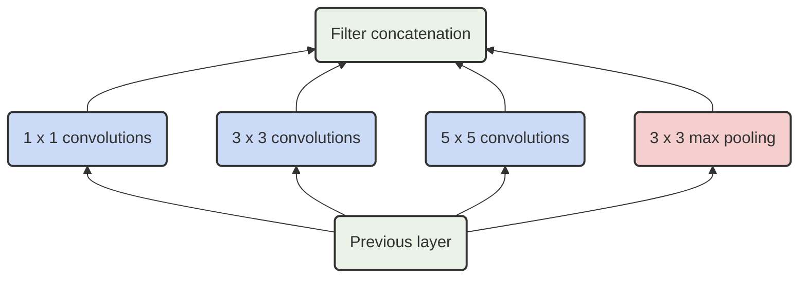
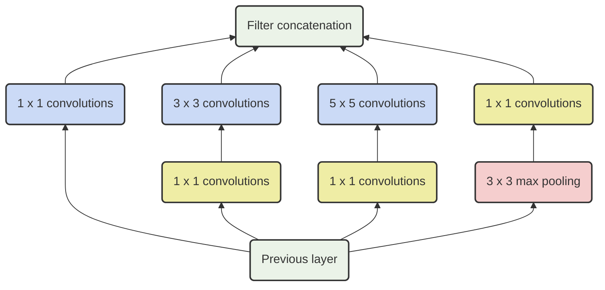

# GoogLeNet

## Inception V1

这是最开始的inception，希望使用较宽的稀疏网络结构产生稠密的数据。

但是这样的计算代价比较高昂，作者采用在 $3\times 3$ 和 $5\times 5$ 的卷积层前加了 $1\times1$ 的卷积层降低通道数，来降低需要计算的参数量，所以 **Inception V1** 的最终形态如下图：

## Inception V2

**Inception V2** 和 **Inception V3** 来自同一篇论文

Iception V2的最重要的改进就是把大卷积核分解成了若干个小卷积核的拼接，减少了参数量

#### $5\times 5  \to 3\times 3$ 

这样使用了小卷积核来降低参数计算量，并且保证了每个神经元的感受野依然是 $5\times5$

### $n\times n \to n\times 1\ \ \ 1\times n$

进一步的，作者把 $3\times3$ 的卷积和，拆分成了 $1\times 3$ 和 $3 \times 1$ 的两个，相当于把线性卷积拆成了两个维度分开出来，类似于高斯卷积核那边的处理。

进而可以把任意的 $n\times n$ 的卷积核拆分成 $1\times n$ 和 $n \times 1$

作者还发现，在网络的前几层使用这种拆分策略效果并不好。该拆分策略比较适用于适当大小的feature map（假设feature map的维度为 $m\times m$，最好 $m$ 可以位于 $12$ 至 $20$ 之内）。基于这种维度的 feature map（$12\leq m\leq 20$），当 $n=7$ 时可以获得很好的结果。

## Inception V3

- RMSProp 优化器；
- Factorized 7x7 卷积；
- 辅助分类器使用了 BatchNorm；
- 标签平滑（添加到损失公式的一种正则化项，旨在阻止网络对某一类别过分自信，即阻止过拟合）。

#### Label-smoothing regularation

在原本的样本中只对应一个唯一的 **ground truth**,在 softmax 的时候也是直接 $1/0$ 算交叉熵

作者提出这样太过于 hard,于是提出了软标签的概念：

$q'(k) = (1 - \epsilon)\delta_{k,y} +\frac{\epsilon}{K} $

新的交叉熵

$H'(q,p) = - \sum_{k = 1}^K \log p(k)q'(k) = (1 - \epsilon)H(q,p) + \epsilon H(u,p)$

标签平滑后可以有效减缓过拟合的问题。

### Inception V4

**Inception V4** 采取了两个显式的 **Reduction** 模块

起到了改变网格宽高的作用。

在同一篇论文中作者还把 ResNet 和 Inception 给结合起来+

用残差链接代替了原本的inception中的池化操作
